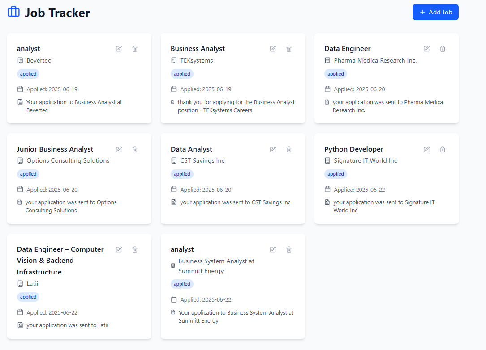

# Job Tracker 📬

A full-stack job application tracker designed for job seekers. It integrates with Gmail IMAP to automatically log job applications by parsing unread confirmation emails from the past 24 hours.

Built with **Golang (Gin)**, **PostgreSQL**, **React**, **Tailwind**, and **Gmail IMAP**.

---

## ✨ Features

- ✅ Add and update job applications manually  
- 📥 Automatically import job applications from Gmail  
- 🔎 (Planned) Filter and categorize jobs  
- ⚡ (Planned) Auto-update job status based on email content

---

## 🛠 Tech Stack

- **Backend:** Go (Gin), GORM, PostgreSQL  
- **Frontend:** React, Tailwind CSS  
- **Email Integration:** Gmail IMAP  
- **Others:** dotenv for configuration

---

## ⚙️ Setup

### 1. Clone the repository

    git clone https://github.com/chanonpu/jobTracker.git
    cd jobTracker

### 2. Backend Setup

- Navigate to the `server/` folder:
```bash
    cd server
    go run main.go
```
- Create a `.env` file in `server/` with:
```bash
    DB_HOST=...
    DB_PORT=...
    DB_USER=...
    DB_PASSWORD=...
    DB_NAME=...
```
### 3. Frontend Setup

- Navigate to `client/` folder:
```bash
    cd ../client
    npm install
    npm run dev
```
### 4. Gmail Auto-Import (Email Watcher)

- Navigate to `AutoTrackEmail/`:
```bash
    cd ../AutoTrackEmail
    go build -o email_watcher.exe
    ./email_watcher.exe
```
- Create a `.env` file in this folder with:
```bash
    EMAIL=your-email@gmail.com  
    PASSWORD=your-app-password
```
> **Note:** Use a Gmail App Password (with 2FA enabled).

---

## 📌 Project Structure

    jobTracker/
    ├── client/               # React frontend
    ├── server/               # Go backend with Gin
    ├── AutoTrackEmail/       # Gmail IMAP integration

---

## 🚧 Roadmap

**Backend**
- Improve email parsing for various confirmation formats
- Auto-update job status based on follow-up emails

**Frontend**
- Add advanced filters (by company, date, source)
- UI/UX enhancements

---

## 📷 Screenshots



---

## 🤝 Contributing

Pull requests are welcome! For major changes, please open an issue first to discuss what you'd like to change.

---

## 📬 Contact

Built by [Chanon Palawatvichai](https://www.linkedin.com/in/chanonpal/)  
Let’s connect if you're interested in **Go**, **automation**, or **job search tooling**!

---

## 📄 License

This project is licensed under the MIT License.
